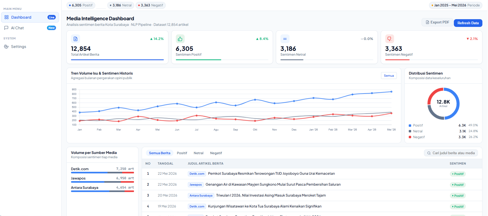
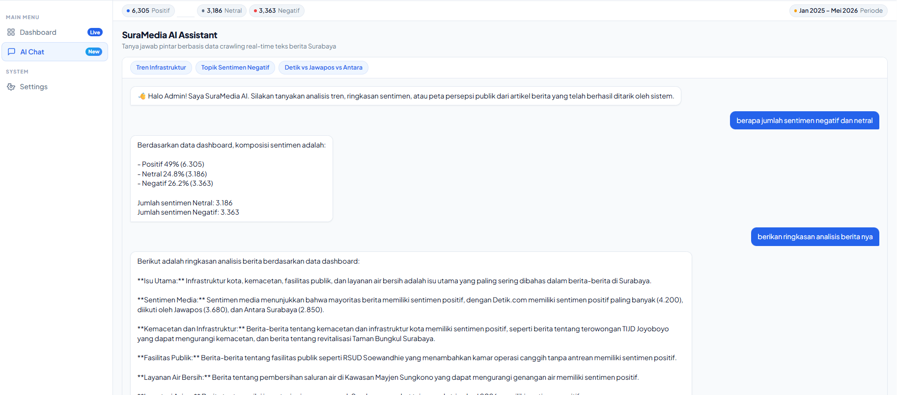
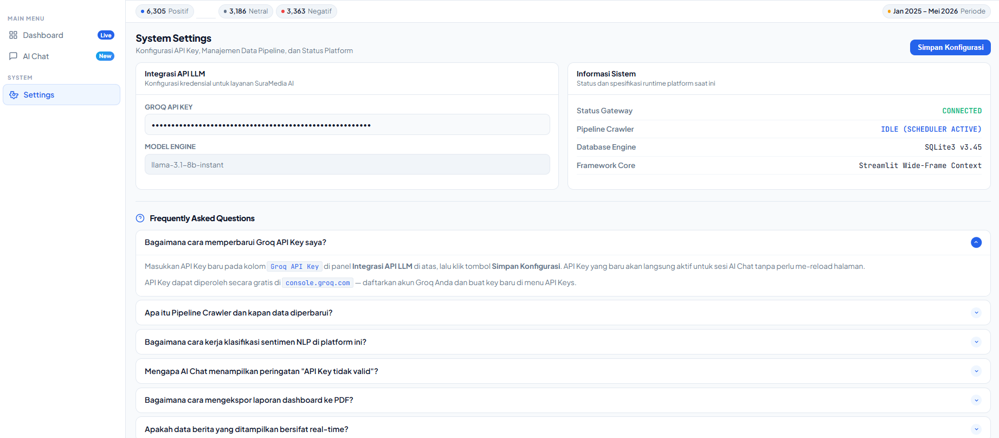

# 🗞️ SuraMedia Intelligence Platform
> Dashboard analitik pemantauan sentimen berita Kota Surabaya berbasis NLP dan Generative AI

Dikembangkan sebagai proyek magang mandiri di **Dinas Komunikasi dan Informatika (Kominfo) Kota Surabaya**, Divisi Statistik — 2025/2026.

---

## 📌 Tentang Proyek

SuraMedia Intelligence Platform adalah sistem *end-to-end* yang mengotomasi proses pemantauan pemberitaan media daring Kota Surabaya — mulai dari pengumpulan artikel, pembersihan teks, klasifikasi sentimen berbasis NLP, hingga visualisasi interaktif dan tanya jawab analitis berbasis AI.

Platform ini dibangun sebagai *proof of concept* untuk mendemonstrasikan potensi pemanfaatan teknologi AI dalam mendukung fungsi pemantauan media di lingkungan pemerintah daerah.

---

## 📊 Dataset

| Komponen | Detail |
|---|---|
| Total artikel | 12.854 artikel berita |
| Sumber | Detik.com, Jawapos, Antara Surabaya |
| Periode | Januari 2025 – Mei 2026 |
| Sentimen Positif | 6.305 artikel (49,0%) |
| Sentimen Netral | 3.186 artikel (24,8%) |
| Sentimen Negatif | 3.363 artikel (26,2%) |

> ⚠️ Full dataset tidak disertakan di repository karena ukuran file. Jalankan pipeline scraper untuk mengumpulkan data secara mandiri.

---

## 🛠️ Tech Stack

- **Backend & Pipeline** — Python, SQLite3
- **Web Scraping** — Requests, BeautifulSoup4
- **NLP & Preprocessing** — Transformers (HuggingFace), PySastrawi, Scikit-learn
- **Dashboard** — Streamlit, Vanilla JS, Chart.js
- **Generative AI** — LLaMA 3.1 8B via Groq API

---

## 📁 Struktur Repository

```
suramedia-intelligence-platform/
│
├── scraper/
│   ├── antaranews.py          # Crawler Antara Surabaya
│   ├── jawapos.py             # Crawler Jawapos
│   └── extract_konten_berita.py  # Ekstraksi konten artikel
│
├── pipeline/
│   ├── buat_database.py       # Inisialisasi database SQLite
│   ├── preprocessing.py       # Text cleaning, stopword, stemming
│   └── modelling_sentiment.py # Klasifikasi sentimen NLP
│
├── dashboard/
│   └── app_dashboard.py       # Aplikasi web utama (Streamlit)
│
├── data/
│   └── sample_dataset.csv     # Sampel 500 baris dataset
│
├── .gitignore
├── requirements.txt
└── README.md
```

---

## 🚀 Cara Menjalankan

### 1. Clone repository
```bash
git clone https://github.com/USERNAME/suramedia-intelligence-platform.git
cd suramedia-intelligence-platform
```

### 2. Install dependencies
```bash
pip install -r requirements.txt
```

### 3. Jalankan pipeline (opsional — jika ingin kumpulkan data baru)
```bash
# Inisialisasi database
python pipeline/buat_database.py

# Jalankan scraper
python scraper/antaranews.py
python scraper/jawapos.py
python scraper/extract_konten_berita.py

# Preprocessing & klasifikasi
python pipeline/preprocessing.py
python pipeline/modelling_sentiment.py
```

### 4. Jalankan dashboard
```bash
streamlit run dashboard/app_dashboard.py
```

### 5. Konfigurasi Groq API Key
Buka browser → `http://localhost:8501` → menu **Settings** → masukkan Groq API Key kamu.

> API Key Groq bisa didapatkan gratis di [console.groq.com](https://console.groq.com)

---

## 📸 Screenshot

### Dashboard Utama


### AI Chat


### Settings


---

## ⚠️ Catatan Penting

- File database (`.db`) tidak disertakan — generate ulang menggunakan pipeline di atas
- Full dataset CSV tidak disertakan karena ukuran (~24MB). Tersedia versi sampel di folder `data/`
- Groq API Key diinput secara manual melalui modul Settings di dashboard, tidak hardcoded

---

## 👤 Author

**[Nama Kamu]**  
Mahasiswa Magang — Divisi Statistik  
Dinas Komunikasi dan Informatika (Kominfo) Kota Surabaya  
2025/2026
